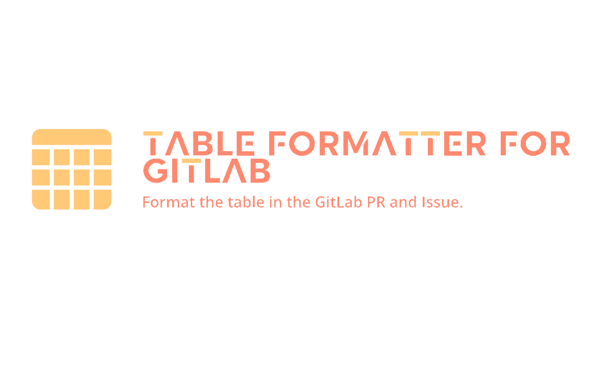
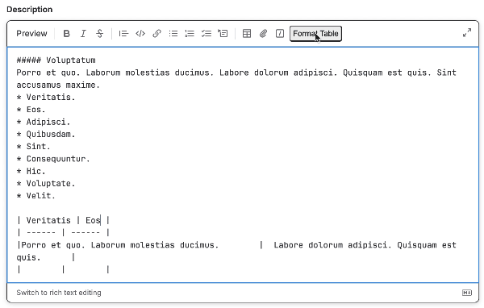

# Table Formatter for GitLab

Format the table in the GitLab MR and Issue.

## How to use

1. Go to the GitLab edit page for the issue or merge request.
1. Create a table element in description.
1. Click the "**Format Table**" button to format the table element.

## Link

- [GitLab](https://about.gitlab.com/)
