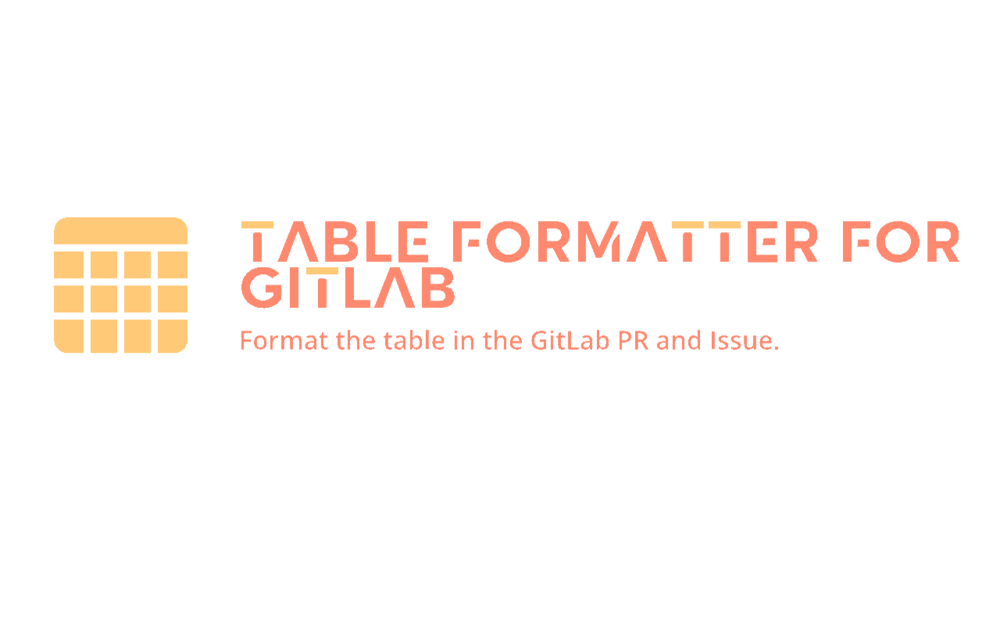
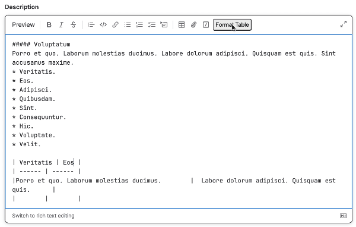

# Table Formatter for GitLab™

Format the table in the GitLab™ MR and Issue.

## Installation

## How to use

1. Go to the GitLab™ edit page for the issue or merge request.
1. Create a table element in description.
1. Click the "**Format Table**" button to format the table element.

## Link

- [GitLab™](https://about.gitlab.com/)

## License

This project is licensed under the MIT License - see the [LICENSE](LICENSE) file for details.
